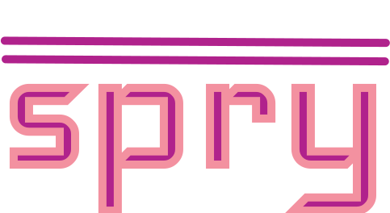

<h1 align=center>
   
</h1>

<h5 align=center>Start Date: 11th November, 2022.</h5> 

Spry is an online clothing store located in Lagos, Nigera. We provide our customers with a distinct and enjoyable experience, selling them the most comfortable clothing for the most comfortable prices.

## 🚀 Production

The live version of this project is hosted by Vercel here.

## 🤖 Tech Stack

1. A large portion of the project is written in **Typescript**.
2. The project depends on version 3 of the **Nuxt.js** framework, which in turn depends on the **Vue** Javascript library.
3. This project makes use of the **Tailwind CSS** framework and preprocessor.
4. The testing framework used in this project is **Cypress**.
5. The backend for this project is hosted in **Google Firebase**.

## 🎨 Design

The user interface design for the website can be found on Figma at [this link](https://www.figma.com/file/LnagRB2PT5HP1p1MklN7xJ/Spry-Clothing-Store?node-id=0%3A1&t=AgmdniLABihsHdev-1). The main font family is [Nunito Sans](https://fonts.google.com/specimen/Nunito+Sans), and the theme colors are:

-  <svg width=15 height=15 viewBox="0 0 100 100"><circle cx=50 cy=50 r=50 fill="#361134"/></svg> Dark Purple,
-  <svg width=15 height=15 viewBox="0 0 100 100"><circle cx=50 cy=50 r=50 fill="#B0228C"/></svg> Fandago
-  <svg width=15 height=15 viewBox="0 0 100 100"><circle cx=50 cy=50 r=50 fill="#EA3788"/></svg> Flickr Pink
-  <svg width=15 height=15 viewBox="0 0 100 100"><circle cx=50 cy=50 r=50 fill="#E56B70"/></svg> Candy Pink
-  <svg width=15 height=15 viewBox="0 0 100 100"><circle cx=50 cy=50 r=50 fill="#F391A0"/></svg> Salmon Pink

## 🤍 Development and Contribution

This project is `0%` complete. The commit roadmap can be seen [here](roadmap.md).

To contribute to this project, first clone the repository, then run `npm install`, followed by `npm run dev`. The second command should start up a local development server at http://localhost:3000.

Checkout the [Nuxt deployment documentation](https://v3.nuxtjs.org/guide/deploy/presets) for more information.
